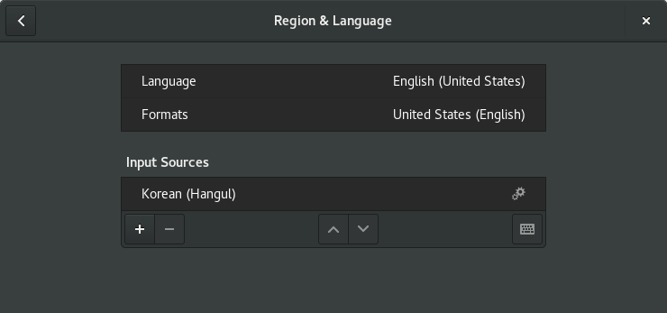
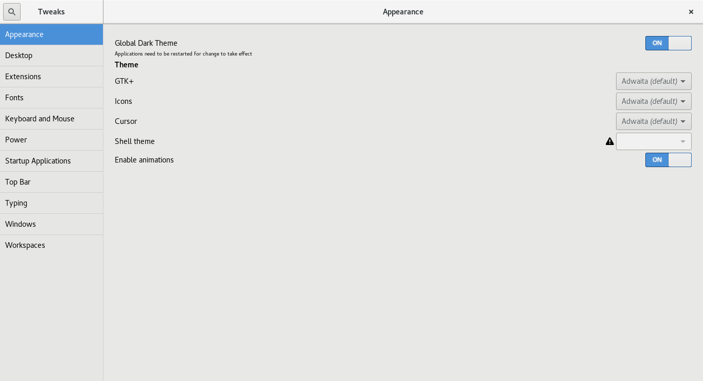
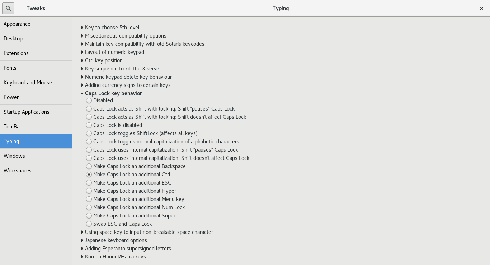

# Fedora24 Setting

## Install

한글 설정으로 설치

root 비밀번호 
계정 및 계정 비밀번호 설정 ( 여기서 admin 등록 체크 )

## Environment

### Language

### CapsLock and Dark Theme

Tweak tool

	$ sudo dnf install -y gnome-tweak-tool
	$ gnome-tweak-tool

tip) dnf install 명령 뒤에 -y를 붙이면 어플리케이션 설치 시에  자동으로 Yes 설정 ( yes or no 를 묻지 않음 )

### 

	$ sudo dnf update -y

### C/C++ Compilers

	$ sudo dnf install -y gcc	# C compiler
	$ sudo dnf install libgcc.i686 glibc-devel.i686 # comiling 32bit
	$ sudo dnf install -y gcc-c++	# C++ compiler
	$ sudo dnf install -y clang	# CLANG

	$ sudo dnf install -y cmake	# CMake Install

